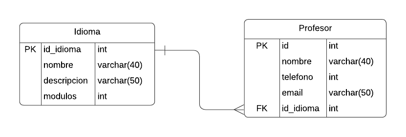

# InstitutoIdiomas
Instituto de Idiomas Pagina Web
Integrantes: Biondi, Mateo ; Bianco, Florencia.

Este trabajo aborda el desarrollo de una pagina web que consiste en una Escuela de Idiomas donde los usuarios pueden acceder a clases virtuales. 
Nuestro modelo de datos establece una relacion 1 a N entre las tablas Idioma y Profesor. 
Establecimos para nuestro sitio que un idioma puede ser enseñado por distintos profesores y que cada profesor puede enseñar un solo idioma.
La clave forànea corresponde al atributo id_idioma de la tabla Profesor.
La clave primaria corresponde al atributo primario autoincremental id_idioma de la tabla Idioma. 



## TPE - Parte 2

Acceso Publico:
El sitio web cuenta con una barra de navegacion que el usuario puede recorrer de manera libre, accediendo a la lista de categorias (correspondiente a los Idiomas) y lista de Items (correspondiente a los Profesores).
Desde el home del sitio puede accederce a los items por categoria y los detalles de cada uno de ellos.

Acceso Administrador de Datos:
Designamos como administrador del sitio web un usuario administrador el cual debe loguearse con los siguientes datos a traves del boton disponible en la barra de navegacion:
```
Email: webadmin@web2.com
Password: admin
```
Unicamente el usuario administrador puede modificar, agregar y eliminar items o categorias.

La administacion de items y categorias del sitio web puede realizarse a traves de los botones disponibles y acceso a traves de URL semantica:

Administracion de Items:
/profesores -> Lista de Items 
/agregar/profesor -> Agregar Item 
/eliminar/profesor/id -> Eliminar Item 
/Modificar/profesor/id -> Modificar Item

Administracion de Categorias:
/idiomas -> Lista de Categorias
/agregar/idioma -> Agregar Categoria 
/eliminar/idioma/id -> Eliminar Categoria 
/Modificar/idioma/id -> Modificar Categoria

Al disponer de una entidad relacion de 1 - N seleccionamos como mecanismo de administracion de datos, el efecto cascada de la categoria al item, es decir, al eliminarse una categoria (idioma) determinamos que no tiene sentido conservar los items (profesores) de la misma.


